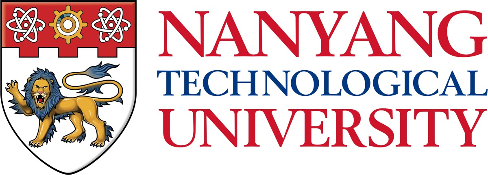

# NTU SCE Final Year Project - Plan

**Student**: Donald Duck  
**Supervisor**: Dr. Nachiket Kapre  
**Date**: 11th August 2013  

Download Markdown template fyp_plan.md.html  
*Sharepoint forces .html extension. Rename .html to .md on download*

> wget http://www.ntu.edu.sg/home/nachiket/advice/fyp_plan.md.html

> mv fyp_plan.md.html fyp_plan.md

To compile on Mac OS X or Ubuntu Linux with
[Pandoc](http://johnmacfarlane.net/pandoc) installed, use

> pandoc fyp_plan.md -o fyp_plan.pdf

**Grading Policy**  

| | | |
|:--|:--|:--|
|10% | Regular 1:1 meetings | The process of conducting yourself through the FYP is as important as the final product. You will be expected to attend all 1:1 weekly meetings. Exceptions only with MCs. |
|10% | Draft plan | A good engineer knows how to provision the most important resource: **time**, for his project. I will expect at least a rough plan outline that we revise as we execute the project. | 
|20% | Regular 15-minute group presentations (once a month) | A good engineer is also a good oral communicator. I will expect short 15-minute presentations to my research group once a month. Ultimately, I want you to become confident speakers and great communicators.. |
|30% | Final report | Technical report writing is very different from writing an exam. In industry, you will be expected to be precise with your specifications and communications. At the same time, you need to tell a **good story**. You need to connect with your reader at several levels. |
|20% | Final presentation | This should be the ultimate/improved version of your regular group presentations |

# Abstract (200 words)

- Crisp, quantitative Claim of what you are planning to show
	- e.g. We can make SPICE run 10 times faster using cheap off-the-shelf hardware (**correct**) 
	- e.g. SPICE runs faster when using our ideas (**wrong**)

# Perspective (1/2 page)

- What do you want to learn from this project?
- How do you expect your advisor to help you out?
- What is the one thing you truly love about computer engineering? Feel free to describe a topic outside the scope of the FYP.

# Planning (2 pages)

- Include your term calendar. The advisor should have an idea of how loaded you are during the semester and how much effort/work can you put in. It is ok to attach just a JPG or screenshot of your StudentLink calendar.
- Also attach a rough sketch of your proposed plan. Try to use a simple Table format organized by month.
- When you are actually done, attach another plan of actual execution.
	- This should hopefully teach you to plan your projects better for the future.

- Feel free to fill the following template directly in Markdown.

| | |
|:--|:--|
| Month 1 | Foraging for berries and fruit |
| Month 2 | Building hut for shelter against rain... |
| Month 12 | Get rescued from island |

# Resources (1/2 page)

- What hardware/software infrastructure do you need for your project?
- Are you comfortable with these platforms? How will you learn about these new platforms?

# Reading List (1 pages)

- Talk to your advisor to get a reading list. By the end of the project, each of the suggested references should become short paragraphs of description.

 Updated: 11th August 2013 
