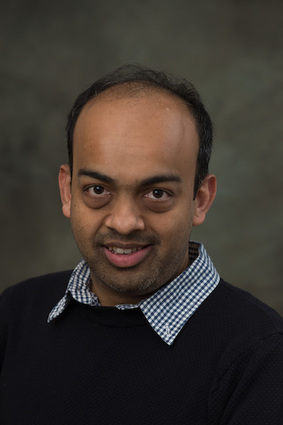

<!-- Compilation Instructions
pandoc index.md -s -c stylesheets/styles.css -o index.html
-->

<header>
#Nachiket Kapre
</header>
	
<section>

**Assistant Professor**, School of Computer Engineering, NTU  
**Chief Technology Officer**, [Plunify](http://www.plunify.com) Inc.  
**Junior Research Fellow**, Imperial College London (2010-2012)  
**Ph.D.**, California Institute of Technology (2010)  
**MS** CS, California Institute of Technology (2006)  
**MS** EE, California Institute of Technology (2005)  

### Research ###

CV and Publications | [HTML](./cv.html) | [PDF](./cv.pdf)  
Google Scholar Profile | [Link](http://scholar.google.co.in/citations?user=JxwwXHMAAAAJ) 
Research | [Link](./research/research.html)  
Quotes | [Link](./quotes.html)  

### Teaching ###

| | |
|:--|:--|
| **2015-16**  | | 
|CE4054 | [Programmable System-on-Chip](http://codeventure.sce.ntu.edu.sg/teaching/2016/ce4054_psoc/index.html) 
|CE4052 | [Embedded Software Development](http://codeventure.sce.ntu.edu.sg/teaching/2015/ce4052_embsysdev/index.html) 
|CE3001 | [Advanced Computer Architecture](http://codeventure.sce.ntu.edu.sg/teaching/2015/ce3001_advcomparch/index.html) 
| **2014-15** | | 
|CE4052 | [Embedded Software Development](http://codeventure.sce.ntu.edu.sg/teaching/2014/ce4052_embsysdev/index.html) 
|CE1005 | [Digital Logic](http://codeventure.sce.ntu.edu.sg/teaching/2014/ce1005_digital_logic/index.html) 
|CE4054 | [Programmable System-on-Chip](http://codeventure.sce.ntu.edu.sg/teaching/2015/ce4054_psoc/index.html) 
| **2013-14** | | 
|CE7451 | [Research Methods in Computer Science & Engineering](http://yarvard.sce.ntu.edu.sg/teaching/2013/ce7451_resmeth/index.html) 
|CE4052 | [Embedded Software Development](http://yarvard.sce.ntu.edu.sg/teaching/2013/ce4052_embsysdev/index.html) 
|ES7501 | [Electronic Design Automation](http://yarvard.sce.ntu.edu.sg/teaching/2013/es7501_eda/index.html) 
|CE4054 | [Programmable System-on-Chip](http://yarvard.sce.ntu.edu.sg/teaching/2014/ce4054_psoc/index.html) 
| | |

### Openings 
I am looking for qualified and motivated graduate students to join my group as PhD students and RAs.
I have part-time openings for Final Year UG and MSc students with good programming and software engineering skills.

### News and Information

| |     |
| :-- | :-- |
| **2016**  | | 
|2/7| One full paper accepted to CASES 2016.                                                                                                                                 |
|20/6| Three full, one short accepted to FPL 2016.                                                                                                                                 |
|2/3| One full, one short and two posters accepted to FCCM 2016.                                                                                                                                 |

| |     |
| :-- | :-- |
| **2015**  | | 
|15/11| One full, one short and one poster accepted to FPGA 2016.                                                                                                                                 |
|2/11| One journal article accepted to Supercomputing Frontiers.|
|17/9| One journal article accepted to TRETS.|
|3/9| The Hoplite NoC paper with Jan Gray won Michael Servit Best Paper award at FPL 2015 , [Certificate](./images/fpl2015_award.jpg), [Photo](./images/21145343661_eb2fef0d35_o.jpg).   |
|10/8| I'm PI on a Tier-1 grant for Machine Learning in FPGA CAD (S$100K).   |
|4/8| I'm a Co-PI on a Delta Electronics grant led by Arindam (S$100K Co-PI).          |
|15/6| I'm a Co-PI on an MIT-SMART grant led by Arindam (S$60K Co-PI).          |
|5/6| Two full papers, one poster accepted to FPL 2015.                          |
|18/5| One full paper accepted to ASAP 2015.                          |
|3/3| Three full papers, one poster selected for FCCM 2015.                          |
|17/2| Paper selected for Supercomputing Frontiers 2015 (organized by A\*Star, Singapore).                         |
|16/2| Two full papers accepted to RAW 2015 (co-located with IPDPS 2015).                          |
| |     |

| |     |
| :-- | :-- |
| **2014**  | | 
|15/12| I will be the Technical Program Co-Chair for FPT 2015 next year in Queenstown, New Zealand. \[[link](http://fpt.massey.ac.nz)\]                                                |
|24/11| My third Edex (Excellence in Education) grant as PI accepted S$37K (**Co-PI**: Anupam Chattopadhyay).                                                                       |
|13/11 | One full, one short and one poster accepted to FPGA 2015.                                                                                                                                 |
|19/9| Two short papers accepted at FPT 2014.                                                                                                                                                    |
|1/8| Full paper accepted at HiPC 2014 (collaboration with NTU EOS).                                                                                                                            |
|21/7| Full paper accepted at DFM 2014 (co-located with PACT 2014).                                                                                                                              |
|10/7| I have started consulting as CTO at [Plunify](http://plunify.com/en/management.php).                                                                                                      |
|25/6| One FPL 2014 full paper (Best Paper Nominee) and poster accepted.                                                                                                                         |
|13/3| Three FCCM 2014 short papers accepted.                                                                                                                                                    |
|20/2| CE4054 [Hackathon](./teaching/ce4054_hackathon_2014.png) announced.                                                                                                                       |
| |     |

| |     |
| :-- | :-- |
| **2013**  | | 
|6/12  | Abid's TPDS 2013 journal article accepted .                                                                                                                                                |
|30/11 | AcRF Tier 1 Grant as PI accepted S$150K.                                                                                                                                                   |
|28/10 | My second Edex (Excellence in Education) grant as PI accepted S$40K (**Team**: Arvind Easwaran, Iris Lee Chai Hong).                                                                       |
|2/10  | One FPT 2013 full paper accepted.                                                                                                                                                         |
|13/8  | My PhD student Abid Rafique wins the [HiPEAC Paper Award](http://www.hipeac.net/award) 2013 for our FCCM 2013 paper, [Certificate](./images/hipeac2013_award.pdf).                       |
|8/8   | My Edex (Excellence in Education) grant [team](./images/edex2013_team.jpg) wrapped up their summer project on automating assesment.  
|30/4  | My paper is one of the 25 most influential papers at FCCM in past 20 years [FCCM20](http://tcfpga.org/fccm20/), [Certificate](./images/fccm20_award.pdf).  
|25/4  | Siddhartha wins 50th DAC Richard Newton Student Fellow grant.  
|24/4  | Dulitha joins my lab as research staff.  
|18/3  | I'm the PI/PL on our successfull CELT Edex (Excellence in Education) Grant S$25K (**Team**: Kyle Rupnow, Iris Lee Chai Hong, Raphael Rubin).  
|2/3   | I'm organising the 2013 NTU Roadmapping Workshop on the Future of Spatial Architectures [Flyer](./images/reconfig_workshop.jpg), [Participants](./images/workshop_participants.jpg).  
|2/3   | Two FCCM 2013 full papers accepted.  
| |     |

| |     |
| :-- | :-- |
| **2012**  | | 
|17/12 | I'm a PI on our successfull S$50K NTU College of Engineering Seed Fund grant (Co-PI: Kyle Rupnow).  
|1/10  | I've started as an Assistant Professor at SCE, NTU.  
| |     |

### Misc ###

Class/Group Presentations:
[Pointers to Talks/Slides on Useful Research Skills](./advice/more_pointers.html)
Final Year Projects:
[Initial Plan](./advice/fyp_plan.html),
[Interim Report](./advice/fyp_interim.html),
[Final Report](./advice/fyp_report.html) 
[Oral](./advice/fyp_oral.html)  
MSc Dissertations:
[Plan](./advice/msc_plan.html)
[Final Report](./advice/msc_dissertation.html)

[College Humor (NTU Edition)](./advice/college_humor.html)  

### Memories

London Retrospective 
[2010](./images/london_retrospective/2010) 
[2011](./images/london_retrospective/2011) 
[2012](./images/london_retrospective/2012)  
Philadelphia Retrospective 
[2006-2010](./images/philadelphia_retrospective/index.html)  
Pasadena Retrospective 
[2003-2006](./images/pasadena_retrospective/index.html)

</section>

