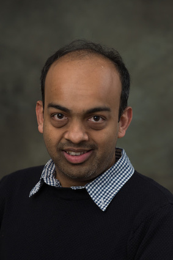

<!-- Compilation Instructions
pandoc --columns=160 index.md -s -c stylesheets/styles.css --metadata pagetitle="Nachiket Kapre's Academic Webpage" -o index.html
-->

<header>
# Nachiket Kapre
</header>

<section>

[Main](./index.html) | [CV](./cv.html) | [Research](./research.html) | [Teaching](./teaching.html) | [Awards](./awards.html)  

**Professor**, Electrical and Computer Engineering, University of Waterloo, Canada (2026-present)  
**Visiting Fellow**, Tenstorrent LLC (2026)  
**Associate Professor**, Electrical and Computer Engineering, University of Waterloo, Canada (2020-2026)  
**Leave of absence**, Research Director, Xilinx Labs (now AMD Research) Singapore (2022-2023)  
**Assistant Professor**, Electrical and Computer Engineering, University of Waterloo, Canada (2016-2020)  
**Chief Technology Officer**, [Plunify](http://www.plunify.com) Inc (2014-2016)  
**Assistant Professor**, School of Computer Engineering, NTU (2012-2016)  
**Junior Research Fellow**, Imperial College London (2010-2012)  
**Consultant**, [Maxeler Inc.](https://www.maxeler.com) (now part of Groq, whose inference technology is [licensed by NVIDIA](https://groq.com/newsroom/groq-and-nvidia-enter-non-exclusive-inference-technology-licensing-agreement-to-accelerate-ai-inference-at-global-scale)) (2011-2012)  
**Ph.D.**, California Institute of Technology (2010)  
**M.S.** CS, California Institute of Technology (2006)  
**M.S.** EE, California Institute of Technology (2005)  

### News and Information

#### 2026

| Date | News |
| :---------- | :------------------------------------------------------------------------ |
| Sep 15 |  FPL 2026 Stamatis Vassiliadis Memorial Best Paper Award for "Cocotb-PYNQ-PR: From Co-Simulation to Deployment, A Unified DFX Framework for PYNQ".  [Certificate](./images/fpl2206_award.pdf) |

#### 2024

| Date | News |
| :---------- | :------------------------------------------------------------------------ |
| Dec 17 |  FPT 2024 Best Paper Award for "GraphNoC: Graph Neural Networks for Application-Specific FPGA NoC Performance Prediction".  [Certificate](./images/fpt2024_award.pdf) |
| Nov 1 | One full paper was accepted to FPT 2024.|

#### 2023

| Date | News |
| :---------- | :------------------------------------------------------------------------ |
| Jul 14 |  TRETS Best Paper Award 2023 for the RapidLayout paper.  [Certificate](./images/trets2023_award.jpg) |
| May 8 | I finished my duties as Program Chair of FCCM 2023. |
| Mar 1 | I returned to Canada. |

#### 2022

| Date | News |
| :---------- | :------------------------------------------------------------------------ |
| Jan 3 | I began a leave of absence from Waterloo to work as Research Director at Xilinx Labs (now AMD Research) Singapore. |

#### 2021

| Date | News |
| :---------- | :------------------------------------------------------------------------ |
| May 10 | One full paper was presented at FCCM 2021. |

#### 2020

| Date | News |
| :---------- | :------------------------------------------------------------------------ |
| Aug 14 | I received the Waterloo EngSoc (Engineering Society) Teaching Excellence Award for Spring 2020.|
| Jul 1 | I was promoted to Associate Professor with tenure.|
| May 19 | Two full papers were accepted to FPL 2020.|
| May 4 | One short paper was accepted to FCCM 2020.|

#### 2019

| Date | News |
| :---------- | :------------------------------------------------------------------------ |
| Dec 13 | Our FPT 2019 paper won the Best Paper Award. [Certificate](./images/fpt2019_award.jpg) |
| Oct 8 | One full paper was accepted to FPT 2019 and nominated for Best Paper.|
| May 17 | Two full papers were accepted to FPL 2019.|
| Mar 27 | One full paper and one short paper were accepted to FCCM 2019.|

#### 2018

| Date | News |
| :---------- | :------------------------------------------------------------------------ |
| Nov 16 | One full paper was accepted to FPGA 2019.|
| Sep 16 | Two full papers were accepted to FPT 2018.|
| May 2 | Our TRETS 2017 submission won the Best Paper Award.  [Certificate](./images/trets2017_award.jpg) |
| Mar 13 | One full paper was accepted to ISCA 2018.|
| Mar 5 | Two full papers were accepted to FCCM 2018.|

#### 2017

| Date | News |
| :---------- | :------------------------------------------------------------------------ |
| Oct 15 | I delivered a tutorial on neural networks and embedded SoCs at ESWEEK.|
| Sep 26 | One full paper was accepted to FPT 2017.|
| Jul 25 | I delivered an invited talk on OpenCL programming in Harbin, China.|
| Jul 12 | Two full papers were accepted to FPL 2017.|
| Apr 3 | One short paper was accepted to IWOCL 2017.|
| Mar 7 | Two full papers were accepted to FCCM 2017.|

#### 2016

| Date | News |
| :---------- | :------------------------------------------------------------------------ |
| Dec 14 | One journal article was accepted for publication in TRETS 2017. |
| Nov 20 | One short paper was accepted to FPGA 2017. |
| Nov 11 | One paper was accepted to DATE 2017. |
| Oct 5 | Our CASES 2016 submission won the Best Paper Award.  [Certificate](./images/cases2016_award.jpg) |
| Oct 1 | I moved to the University of Waterloo, Canada. |
| Sep 18 | One paper was accepted to FPT 2016. |
| Aug 25 | One paper was accepted to ACMDev 2016. |
| Jul 16 | Delivered a full-day invited lecture on OpenCL for CPUs, GPUs, and FPGAs at the PAPAA summer school at the University of Hong Kong. |
| Jul 2 | One full paper was accepted to CASES 2016.|
| Jun 20 | Three full papers and one short paper were accepted to FPL 2016.|
| Mar 2 | One full paper, one short paper, and two posters were accepted to FCCM 2016.|

#### 2015

| Date | News |
| :---------- | :------------------------------------------------------------------------ |
| Nov 15 | One full paper, one short paper, and one poster were accepted to FPGA 2016.|
| Nov 2 | One journal article was accepted by Supercomputing Frontiers.|
| Sep 17 | One journal article was accepted by TRETS.|
| Sep 3 | The Hoplite NoC paper, co-authored with Jan Gray, won the Michal Servit Best Paper Award at FPL 2015. [Certificate](./images/fpl2015_award.jpg), [Photo](./images/21145343661_eb2fef0d35_o.jpg). |
| Aug 10 | I was awarded a Tier 1 grant as PI for machine learning in FPGA CAD (S$100K). |
| Aug 4 | I was awarded a Delta Electronics grant as Co-PI, led by Arindam (S$100K Co-PI). |
| Jun 15 | I was awarded an MIT-SMART grant as Co-PI, led by Arindam (S$60K Co-PI). |
| Jun 5 | Two full papers and one poster were accepted to FPL 2015. |
| May 18 | One full paper was accepted to ASAP 2015. |
| Mar 3 | Three full papers and one poster were accepted to FCCM 2015. |
| Feb 17 | One paper was accepted to Supercomputing Frontiers 2015 (organized by A\*STAR, Singapore). |
| Feb 16 | Two full papers were accepted to RAW 2015 (co-located with IPDPS 2015). |

#### 2014

| Date | News |
| :---------- | :------------------------------------------------------------------------ |
| Dec 15 | I was named Technical Program Co-Chair for FPT 2015 in Queenstown, New Zealand. |
| Nov 24 | I was awarded my third Edex (Excellence in Education) grant as PI (S$37K; **Co-PI**: Anupam Chattopadhyay). |
| Nov 13 | One full paper, one short paper, and one poster were accepted to FPGA 2015. |
| Sep 19 | Two short papers were accepted to FPT 2014. |
| Aug 1 | One full paper was accepted to HiPC 2014 (in collaboration with NTU EOS). |
| Jul 21 | One full paper was accepted to DFM 2014 (co-located with PACT 2014). |
| Jul 10 | I began serving as CTO at [Plunify](http://plunify.com/en/management.php). |
| Jun 25 | One FPL 2014 full paper, nominated for Best Paper, and one poster were accepted. |
| Mar 13 | Three short papers were accepted to FCCM 2014. |
| Feb 20 | The CE4054 Hackathon was announced. |

#### 2013

| Date | News |
| :---------- | :------------------------------------------------------------------------ |
| Dec 6 | Abid's TPDS 2013 journal article was accepted. |
| Nov 30 | I was awarded an AcRF Tier 1 grant as PI (S$150K). |
| Oct 28 | I was awarded my second Edex (Excellence in Education) grant as PI (S$40K; **Team**: Arvind Easwaran and Iris Lee Chai Hong). |
| Oct 2 | One full paper was accepted to FPT 2013. |
| Aug 13 | My PhD student Abid Rafique won the 2013 HiPEAC Paper Award for our FCCM 2013 paper. [Certificate](./images/hipeac2013_award.pdf) |
| Aug 8 | My Edex (Excellence in Education) grant [team](./images/edex2013_team.jpg) completed its summer project on automated assessment. |
| Apr 30 | My paper was named one of the 25 most influential FCCM papers from the previous 20 years. [Certificate](./images/fccm20_award.pdf) |
| Apr 25 | Siddhartha won a 50th DAC Richard Newton Young Student Fellow grant. |
| Apr 24 | Dulitha joined my lab as a research staff member. |
| Mar 18 | I was awarded a CELT Edex (Excellence in Education) grant as PI/PL (S$25K; **Team**: Kyle Rupnow, Iris Lee Chai Hong, and Raphael Rubin). |
| Mar 2 | I organized the 2013 NTU Roadmapping Workshop on the Future of Spatial Architectures. [Flyer](./images/reconfig_workshop.jpg), [Participants](./images/workshop_participants.jpg) |
| Mar 2 | Two full papers were accepted to FCCM 2013. |

#### 2012

| Date | News |
| :---------- | :------------------------------------------------------------------------ |
| Dec 17 | I was awarded an S$50K NTU College of Engineering Seed Fund grant as PI (Co-PI: Kyle Rupnow). |
| Oct 1 | I started as an Assistant Professor at SCE, NTU. |

### Misc ###

Class/Group Presentations:
[Pointers to Talks/Slides on Useful Research Skills](./advice/more_pointers.html)

---

### Memories

Singapore Retrospective (2012-2016) 
London Retrospective
[2010](./images/london_retrospective/2010)
[2011](./images/london_retrospective/2011)
[2012](./images/london_retrospective/2012)  
Philadelphia Retrospective
[2006-2010](./images/philadelphia_retrospective/index.html)  
Pasadena Retrospective
[2003-2006](./images/pasadena_retrospective/index.html)

</section>

<!-- Google tag (gtag.js) -->

