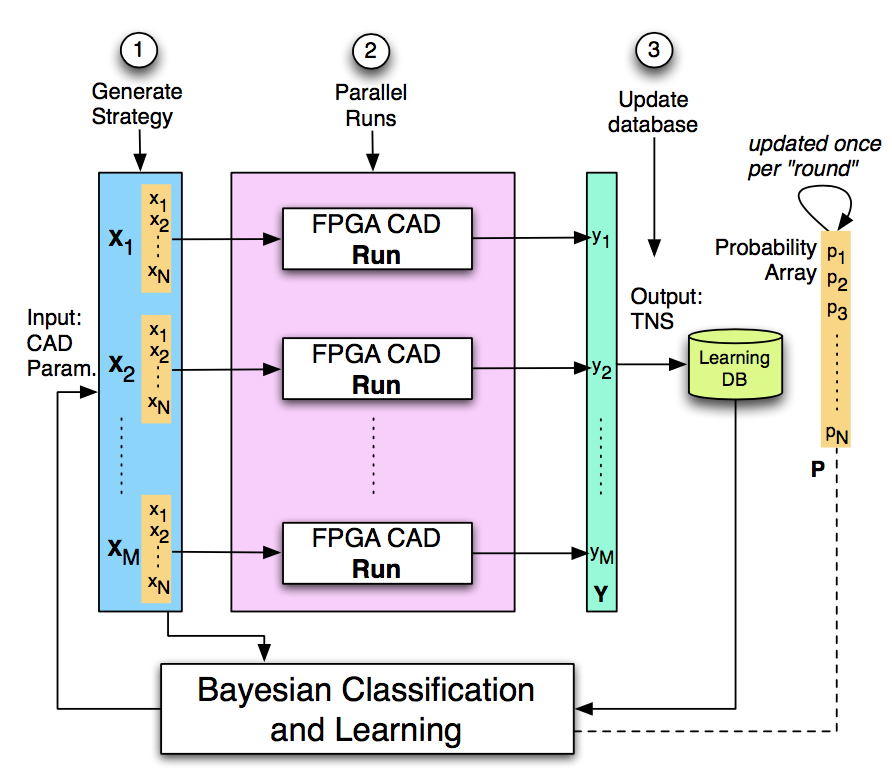
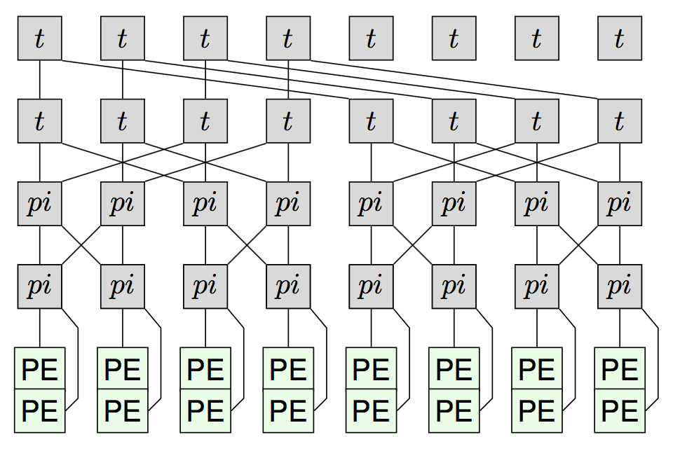
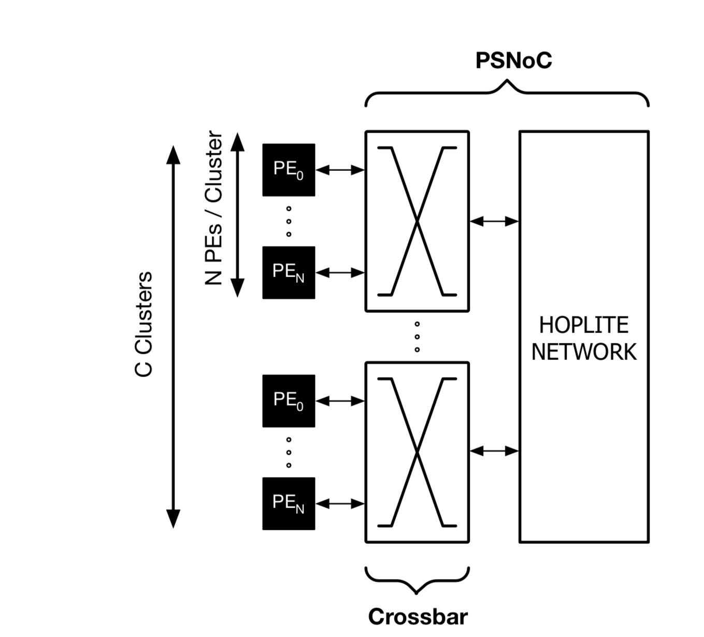

<!-- Compilation Instructions
pandoc \-\-columns=160 research.md -s -c stylesheets/styles.css \-\-metadata pagetitle="Research" -o research.html
-->

<header>
# Research
</header>

<section>
[Main](./index.html) | [CV](./cv.html) | [Research](./research.html) | [Teaching](./teaching.html) | [Awards](./awards.html)  

The **Waterloo Configurable Architectures Group (WatCAG)** develops intelligent
tools and reconfigurable architectures for efficient computing. Our current
work connects machine-learning accelerators, agentic hardware-design flows,
learning-guided FPGA CAD, and communication-centric accelerator architectures.

We are interested in the full path from an application idea to a working
system: choosing the right arithmetic and architecture, generating and
verifying RTL, mapping the design onto reconfigurable hardware, and moving data
efficiently through the resulting accelerator.

## Current Research Directions

### ML and Domain-Specific Accelerators

We design efficient accelerator building blocks and systems for modern machine-learning
workloads. Current questions include how to support rapidly evolving numerical
formats, how to organize tensor and systolic computation, and how to balance
compute, memory bandwidth, communication, and programmability.

- [[PDF]](./publications/jack-of-all-scales_fpl-2026.pdf) **"Jack of All Scales: A Versatile FPGA Tensor Block for MXFP Precisions"**, FPL 2026
- [[PDF]](./publications/stc_fpl-2019.pdf) **"Scaling the Cascades: Interconnect-aware FPGA implementation of Machine Learning problems"**, FPL 2019
- [[PDF]](./publications/caffepresso_cases-2016.pdf) **"CaffePresso: An Optimized Library for Deep Learning on Embedded Accelerator-based platforms"**, CASES 2016 — **Best Paper Award**

### Agentic Hardware Design and Verification

We are exploring agentic workflows that can help translate hardware intent into
efficient, verifiable implementations. This emerging direction builds on our
work in Python-driven simulation, RTL verification, design-space exploration,
partial reconfiguration, and deployment on accessible FPGA platforms. The goal
is to keep engineers in control while automating more of the iterative path
from specification to measured hardware.

- [[PDF]](./publications/cocotb-pynq-pr_fpl-2026.pdf) **"Cocotb-PYNQ-PR: From Co-Simulation to Deployment, A Unified DFX Framework for PYNQ"**, FPL 2026 — **Stamatis Vassiliadis Memorial Best Paper Award**
- [[PDF]](./publications/cocotb-pynq_fpl-2025.pdf) **"Cocotb-Pynq: Co-simulating Python+RTL applications targeting Pynq platforms with Cocotb"**, FPL 2025

### Learning-Guided FPGA Design

We apply machine learning, graph models, evolutionary search, and parallel
optimization to difficult FPGA CAD problems. This work spans performance
prediction, physical design, timing closure, network-on-chip customization, and
tool-parameter selection.

- [[PDF]](./publications/graph-noc_fpt-2024.pdf) **"GraphNoC: Graph Neural Networks for Application-Specific FPGA NoC Performance Prediction"**, FPT 2024 — **Best Paper Award**
- [[PDF]](./publications/rapidlayout_trets-2022.pdf) **"RapidLayout: Fast Hard Block Placement of FPGA-optimized Systolic Arrays using Evolutionary Algorithms"**, TRETS 2022 — **2023 Best Paper Award**
- [[PDF]](./publications/hopliteml_trets-2022.pdf) **"HopliteML: Evolving application customized FPGA NoCs with adaptable routers and regulators"**, TRETS 2022
- [[PDF]](./publications/intime_fccm-2015.pdf) **"Driving Timing Convergence of FPGA Designs through Machine Learning and Cloud Computing"**, FCCM 2015

### Communication-Centric Reconfigurable Architectures

Accelerators are often limited by data movement rather than arithmetic. We
design FPGA networks-on-chip, dataflow overlays, memory systems, and transport
mechanisms that provide predictable, efficient communication from individual
compute blocks to multi-die devices and networked systems.

- [[PDF]](./publications/protocol-independent-transport_arxiv-2026.pdf) **"A Protocol-Independent Transport Architecture"**, arXiv 2026
- [[PDF]](./publications/hbm-noc_fccm-2022.pdf) **"Managing HBM Bandwidth on Multi-Die FPGAs with FPGA Overlay NoCs"**, FCCM 2022
- [[PDF]](./publications/hoplite_trets-2017.pdf) **"Hoplite: A Deflection-Routed Directional Torus NoC for FPGAs"**, TRETS 2017 — **Best Paper Award**

## Research Foundations

Our earlier work established many of the ideas underlying these directions:
spatial and token-dataflow processing, lightweight FPGA overlay networks,
application-specific accelerators, embedded machine learning, sparse graph
processing, and compilation methods that expose communication and energy costs.

- [[PDF]](./publications/dataflow-overlay_fpt-2018.pdf) **"DaCO: A High-Performance Token Dataflow Coprocessor Overlay for FPGAs"**, FPT 2018
- [[PDF]](./publications/soft-vector_trets-2016.pdf) **"Optimizing Soft Vector Processing in FPGA-based Embedded Systems"**, TRETS 2016
- [[PDF]](./publications/green_fpl-2015.pdf) **"Limits of FPGA Acceleration of 3D Green's Function Computation for Geophysical Applications"**, FPL 2015

## Work With Us

We welcome collaborations with students and researchers interested in computer
architecture, digital hardware, FPGA CAD, machine learning, and design
automation. Prospective graduate students should apply through the University
of Waterloo and identify Nachiket Kapre as a potential supervisor.

For a complete publication record, see the [curriculum vitae](./cv.html).

</section>

<!-- Google tag (gtag.js) -->

