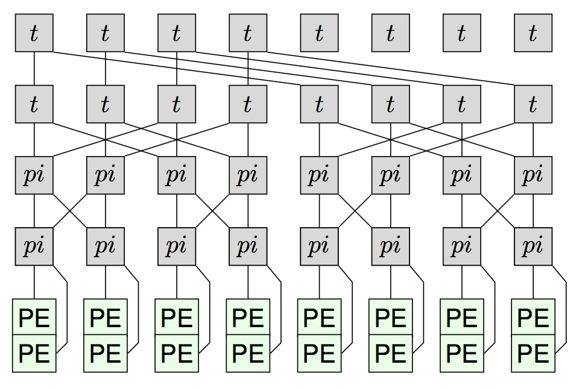
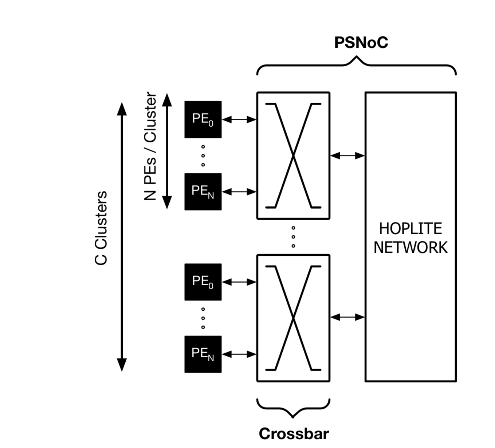
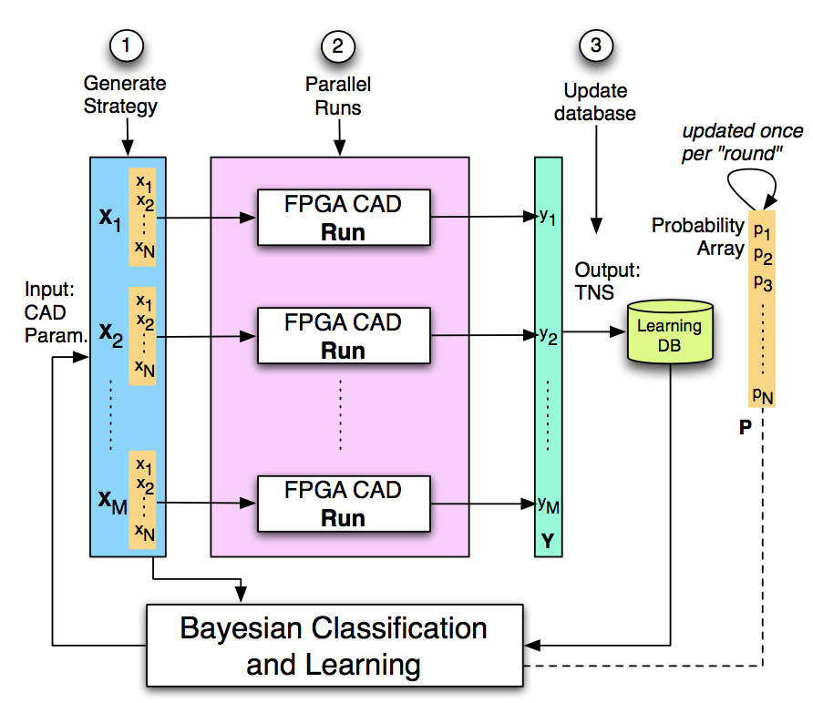

<!-- Compilation Instructions
pandoc research.md -s -c stylesheets/styles.css -o research.html
-->

<header>
# Research
</header>

<section>
In the Waterloo Configurable Architectures Group (WatCAG), we are broadly
interested in understanding and exploiting the potential of spatial
parallelism for implementing computation using reconfigurable architectures
such as FPGAs.  Reconfigurable computing has now come of age with the
multi-billion dollar acquisition of Altera by Intel, and rapid adoption of FPGAs
in the cloud at Microsoft, Amazon, Huawei, Baidu, Alibaba among other cloud
providers. With the rising computing demands of machine learning workloads
coupled with the pending demise of Moore's Law, there has never been a more
exciting time to work in this field than today.

In the WatCAG group, we ask the following big questions:

- What might reconfigurable computing architectures of the future look like, and how will be program them?
- What computing problems are reconfigurable architectures useful for, and how do we seamlessly integrate them in mainstream computing systems (cloud, embedded)?
- Can we rethink the programming abstractions for reconfigurable hardware by emphasizing communication and energy awareness at different levels in the compilation stack?

Specifically, the group looks at a combination of *Architecture*, *Compilation*, and *Application* domains to work towards answering these questions.
</section>

<section>
## Architecture

The group has investigated the design and engineering of token dataflow
overlays, vector processor characterization, embedded system evaluation,
real-time systems, and FPGA-specific network-on-chip architectures for
use in accelerators.

- [[PDF]](./publications/deflection-bft_fpl-2017.pdf) **"Deflection Routed Butterfly Fat Trees on FPGAs"**, FPL 2017
- [[PDF]](./publications/hoplite_trets2017.pdf) **Hoplite: A Deflection-Routed Directional Torus NoC for FPGAs**, TRETS 2017
- [[PDF]](./publications/soft-vector_trets2016.pdf) **Optimizing Soft Vector Processing in FPGA-based Embedded Systems**, TRETS 2016

### Dataflow Architectures
Token dataflow architectures exploit application parallelism dynamically at the granularity of individual instructions. Each instruction implements a dataflow firing rule that replaces a program counter used in conventional sequential CPU processing. The dataflow dependencies are routed over a operand routing network-on-chip to rapidly move data to parallel compute blocks within the chip. The design and engineering of hardware-friendly dataflow building blocks for FPGAs has been a focus of our group.

- [[PDF]](./publications/dataflow-overlay_fpt-2018.pdf) **”DaCO: A High-Performance Token Dataflow Coprocessor Overlay for FPGAs”**, FPT 2018
- [[PDF]](./publications/hopliteq_fccm-2018.pdf) **"HopliteQ: Priority-Aware Routing in FPGA Overlay NoCs"**, FCCM2018
- [[PDF]](./publications/dataflow-limits_dfm2014.pdf) **"Limits of Statically Scheduled Token Dataflow Processing"**, DFM2014

## Applications

We are excited about novel uses of FPGAs in emerging application scenarios in the cloud as well as embedded contexts. The group has published papers in machine learning, 

- [[PDF]](./publications/caffepresso_cases2016.pdf) **CaffePresso: An Optimized Library for Deep Learning on Embedded Accelerator-based platforms**, CASES 2016
- [[PDF]](./publications/green_fpl2015.pdf) **Limits of FPGA Acceleration of 3D Green’s Function Computation for Geophysical Applications**, FPL 2015
- [[PDF]](./publications/opencv-saliency_fccm2015.pdf) **Energy-Efficient Acceleration of OpenCV Saliency Computation using Soft Vector Processors**, FCCM 2015

## Compilation

The group has developed various automation tools, compiler passes, and
frameworks for use with FPGAs. In particular, we have tools to perform
precision analysis, performance tuning, machine-learning driven FPGA
compilation, among other solutions.

- [[PDF]](./publications/intime_fccm2015.pdf) **Driving Timing Convergence of FPGA Designs through Machine Learning and Cloud Computing**, FCCM 2015
- [[PDF]](./publications/ebsp_date2017.pdf) **eBSP: Managing NoC traffic for BSP workloads on the 16-core Adapteva Epiphany-III Processor**, DATE 2017
- [[PDF]](./publications/gpu-bitwidth_fpga2016.pdf) **GPU-Accelerated High-Level Synthesis for Bitwidth Optimization of FPGA Datapaths**, FPGA 2016

</section>

